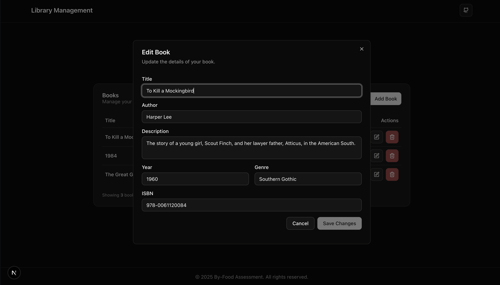

# By-Food Full-Stack Developer Assessment

This repository contains the source code for a full-stack library management application, developed as part of the By-Food software developer assessment. The application includes a React/Next.js frontend and a Golang backend, providing full CRUD functionality for managing a book collection and a URL processing service.

## Features

- **CRUD Operations for Books:** Create, Read, Update, and Delete books in the library.
- **Interactive Frontend:** A user-friendly interface built with Next.js, TypeScript, and Tailwind CSS for a seamless user experience.
- **RESTful Backend:** A robust backend API built with Golang and the Gin framework.
- **URL Processing Service:** A backend service to clean up and redirect URLs based on specific rules.
- **Database Integration:** PostgreSQL is used for data persistence, managed via Docker.
- **API Documentation:** Interactive API documentation using Swagger.
- **Comprehensive Unit Tests:** The backend includes a suite of unit tests to ensure reliability and correctness.

## Tech Stack

- **Frontend:**

  - [Next.js](https://nextjs.org/) (v14+)
  - [React](https://reactjs.org/) (v18+)
  - [TypeScript](https://www.typescriptlang.org/)
  - [Tailwind CSS](https://tailwindcss.com/) for styling
  - [Context API](https://reactjs.org/docs/context.html) for state management
- **Backend:**

  - [Golang](https://golang.org/) (v1.24+)
  - [Gin](https://gin-gonic.com/) Web Framework
  - [PostgreSQL](https://www.postgresql.org/)
  - [Docker](https://www.docker.com/) & [Docker Compose](https://docs.docker.com/compose/)
  - [Swagger](https://swagger.io/) for API documentation

## Prerequisites

Before you begin, ensure you have the following installed on your system:

- [Node.js](https://nodejs.org/en/download/) (v18 or later recommended)
- [pnpm](https://pnpm.io/installation) (or npm/yarn)
- [Docker](https://www.docker.com/products/docker-desktop)
- [Go](https://go.dev/doc/install) (v1.24 or later, for running tests locally)

## Setup and Installation

Follow these steps to set up the project locally.

### 1. Clone the Repository

```bash
git clone <repository-url>
cd byfood-assessment
```

### 2. Backend Setup (Docker)

The backend, including the PostgreSQL database, is containerized using Docker.

1. **Navigate to the backend directory:**

   ```bash
   cd apps/backend
   ```
2. **Create an environment file:**
   Create a `.env` file in the `apps/backend` directory by copying the example values. These match the `docker-compose.yml` configuration.

   ```bash
   # apps/backend/.env
   DB_HOST=postgres
   DB_PORT=5432
   DB_USER=user
   DB_PASSWORD=password
   DB_NAME=library
   DB_SSLMODE=disable
   GIN_MODE=debug
   PORT=8080
   ```
3. **Build and run the containers:**
   From the `apps/backend` directory, run:

   ```bash
   docker-compose up --build
   ```

   This command will build the Golang application, pull the PostgreSQL image, and start both services in detached mode.

   - The backend API will be accessible at `http://localhost:8080`.
   - The PostgreSQL database will be accessible at `localhost:5432`.

### 3. Frontend Setup

1. **Navigate to the frontend directory:**

   ```bash
   cd apps/frontend
   ```
2. **Install dependencies:**
   Using `pnpm` (recommended):

   ```bash
   pnpm install
   ```

   Alternatively, using `npm` or `yarn`:

   ```bash
   npm install
   # or
   yarn install
   ```
3. **Create an environment file:**
   Create a `.env.local` file in the `apps/frontend` directory. This file will contain the URL of the backend API.

   ```bash
   # apps/frontend/.env.local
   NEXT_PUBLIC_API_URL=http://localhost:8080/api
   ```

## Running the Application

- **Backend:** The backend is already running via Docker. You can check the status of the containers with `docker-compose ps` from the `apps/backend` directory.
- **Frontend:** From the `apps/frontend` directory, run:

  ```bash
  pnpm dev
  ```

  The application will be available at `http://localhost:3000`.
- Running the backend and frontend **AT THE SAME TIME:**
  At the project root directory, run:

  ```bash
  pnpm dev
  ```

## Running Tests

The backend includes a suite of unit tests. To run them:

1. **Navigate to the backend directory:**

   ```bash
   cd apps/backend
   ```
2. **Run the tests:**

   ```bash
   go test ./...
   ```

   This command will run all tests in the project.

## API Documentation

The backend API is documented using Swagger. Once the backend is running, you can access the interactive API documentation at:

[http://localhost:8080/swagger/index.html](http://localhost:8080/swagger/index.html)

## Project Structure

This project is a monorepo with the following structure:

```
/
├── apps/
│   ├── backend/      # Golang backend application
│   └── frontend/     # Next.js frontend application
├── package.json
└── README.md
```

## Screenshots





